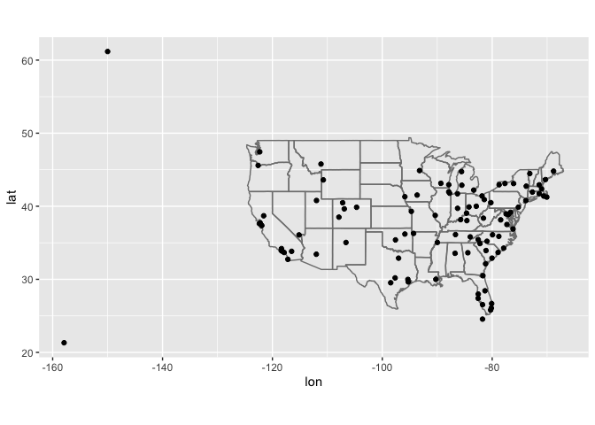
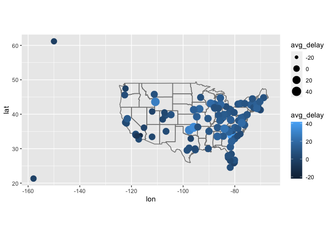

Homework 3
================
Christine Hou
2022-10-13

``` r
library(tidyverse)
```

    ## ── Attaching packages ─────────────────────────────────────── tidyverse 1.3.2 ──
    ## ✔ ggplot2 3.3.6      ✔ purrr   0.3.4 
    ## ✔ tibble  3.1.8      ✔ dplyr   1.0.10
    ## ✔ tidyr   1.2.1      ✔ stringr 1.4.1 
    ## ✔ readr   2.1.2      ✔ forcats 0.5.2 
    ## ── Conflicts ────────────────────────────────────────── tidyverse_conflicts() ──
    ## ✖ dplyr::filter() masks stats::filter()
    ## ✖ dplyr::lag()    masks stats::lag()

``` r
library(ggplot2)
library(dbplyr)
```

    ## 
    ## Attaching package: 'dbplyr'
    ## 
    ## The following objects are masked from 'package:dplyr':
    ## 
    ##     ident, sql

``` r
library(nycflights13)
```

#### 1. Compute the average delay by destination, then join on the airports data frame so you can show the spatial distribution of delays. Here’s an easy way to draw a map of the United States:

``` r
airports %>%
  semi_join(flights, c("faa" = "dest")) %>%
  ggplot(aes(lon, lat)) +
    borders("state") +
    geom_point() +
    coord_quickmap()
```

<!-- -->

#### (Don’t worry if you don’t understand what semi_join() does — you’ll learn about it next.)

#### You might want to use the size or colour of the points to display the average delay for each airport.

``` r
flights %>%
  group_by(dest) %>%
  summarize(avg_delay = mean(arr_delay, na.rm = TRUE)) %>%
  left_join(airports, by = c("dest" = "faa")) %>%
  ggplot(aes(lon, lat, size = avg_delay, color = avg_delay)) +
  borders("state") +
  geom_point() +
  coord_quickmap()
```

    Warning: Removed 5 rows containing missing values (geom_point).

<!-- -->

#### 2. Add the location of the origin and destination (i.e. the lat and lon) to flights.

#### 3. Is there a relationship between the age of a plane and its delays?
